

# withCooking

  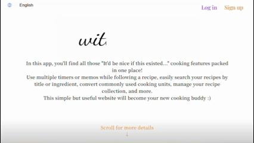

This website offers lots of useful cooking features :) Create your own recipes, register your favorite recipes by their links, use multiple timers or memos while following a recipe, easily search your recipes by title or ingredient, convert commonly used cooking units, manage your recipe collection, and more!

  <h2>Create Recipes</h2>
  
There're two ways to create recipes.

  <h3>1. Create Your Original Recipes from Scratch</h3>
  

    
    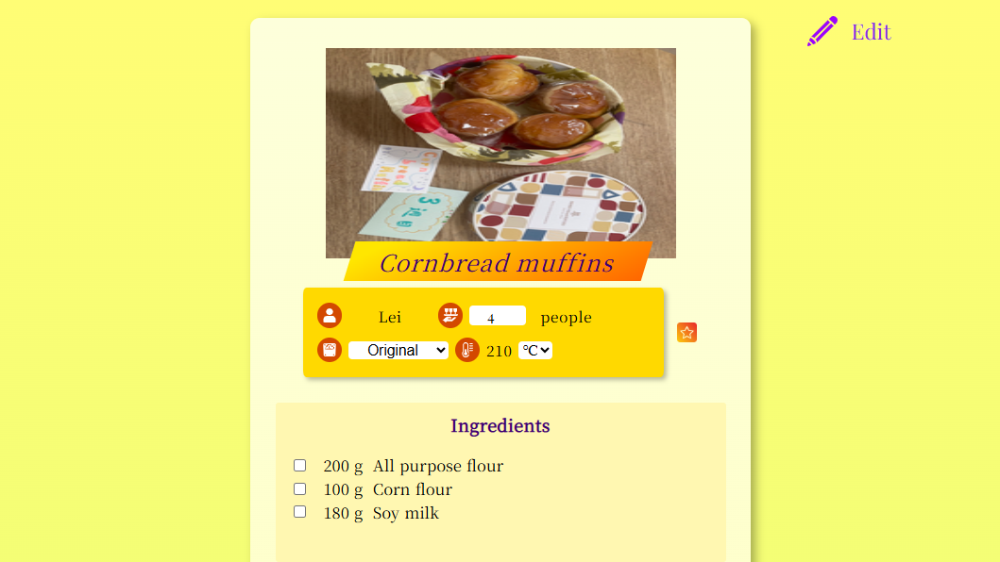
  

  
You can easily create a recipe using a clean, well-organized form!

  <h3>2. Register Your Favorite Recipes by Their Links</h3>
  

    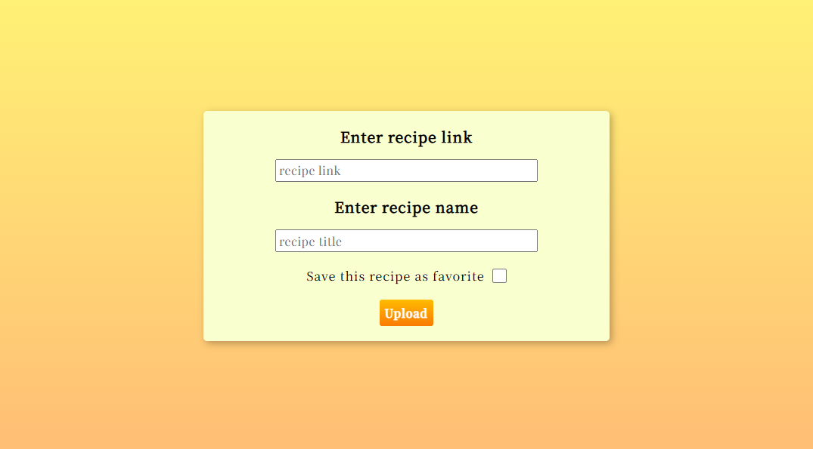
    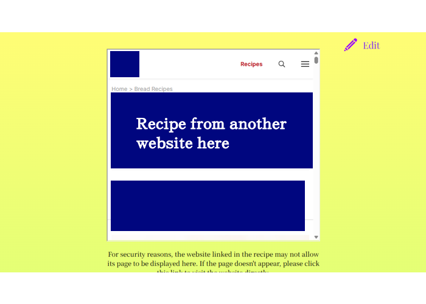
  

  
You can register your favorite recipe by importing one from an external link!

  

  <h2>Recipes</h2>
  <h3>Change Servings, Unit Systems, and Temperature Units</h3>
  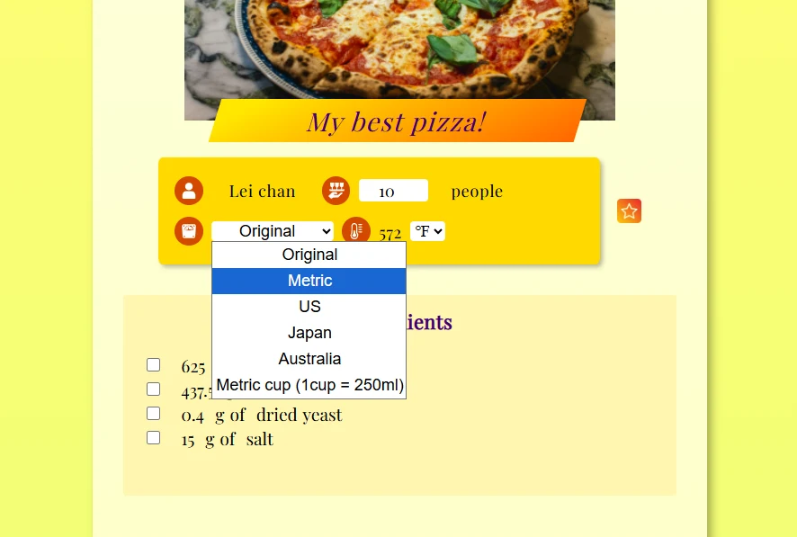
  
You can change servings, unit systems, and temperature units. This website will instantly calculate and display converted ingredients and temparetures.

  <h3>Check Off Each Ingredient</h3>
  

  <h2>Cook with a Recipe</h2>
  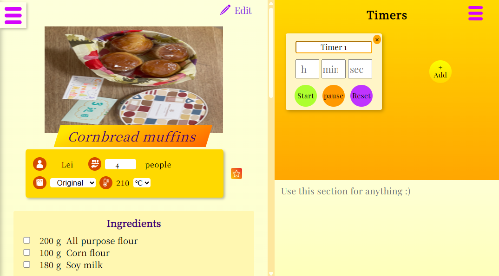
  
Main page

  <h3>Search your recipes by title or ingredient</h3>
  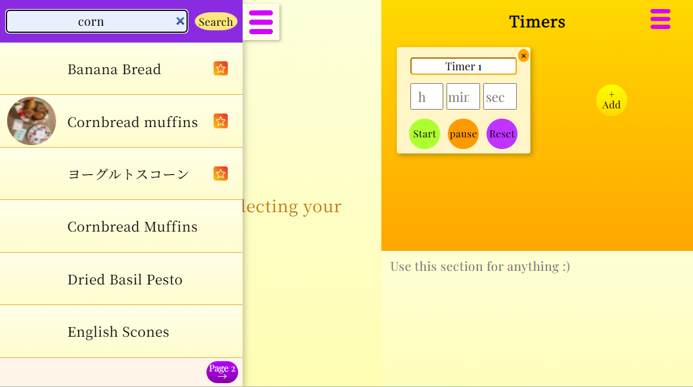
  <h3>Set multiple timers</h3>
  
  <h3>Resize Each Section</h3>
  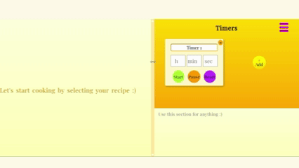

  <h2>Manage Your Recipe Collection</h2>
  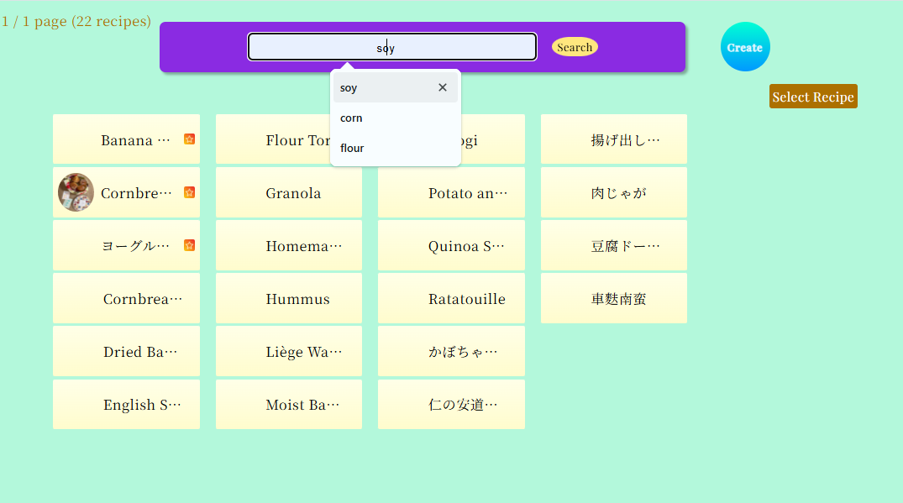

  <h2>Convert Various Types of Units</h2>
  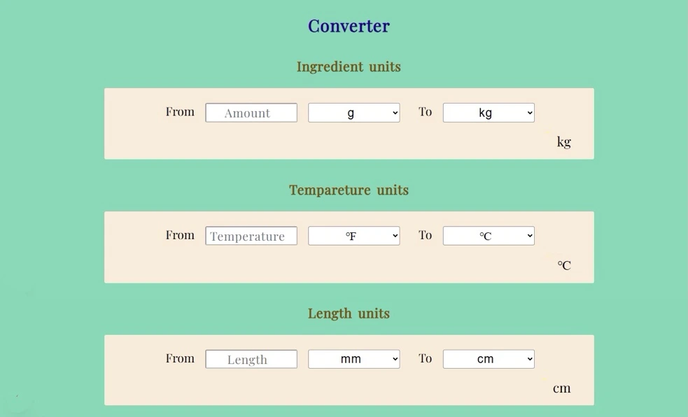
  
You can convert ingredient units (e.g., grams, ounces), temperature units (℉/℃), and length units (e.g., cm, inches).

  <h2>Other Features</h2>
  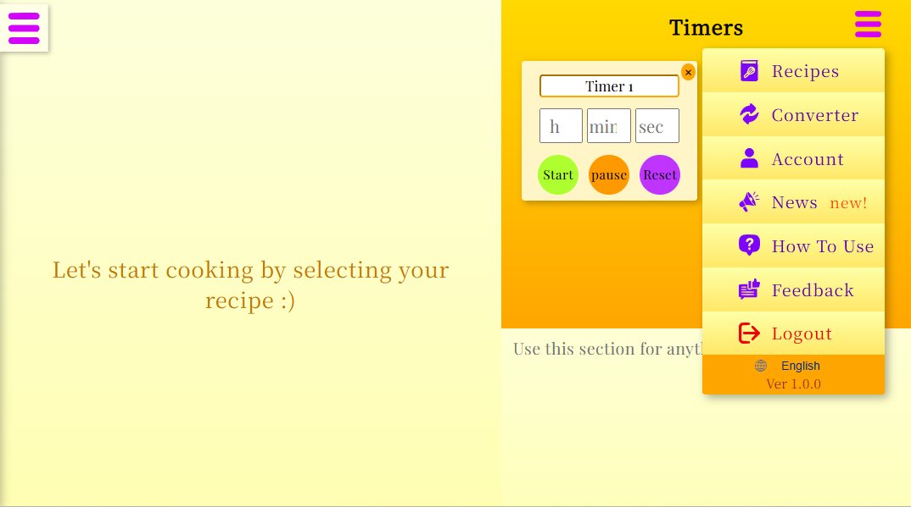
  
There're more other useful features!

